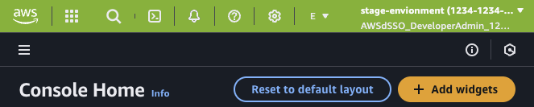

# AWS Header Color Changer

This is a Chrome extension that changes the header color of the AWS console to a color of your choice based on the URL being used to access the console. This is useful if you have multiple AWS accounts and want to easily differentiate between them as below.


The plugin can be configured via JSON




The plugin lets you set a color for each account by specifying a partial URL and a color. If the pattern matches, the color is applied to the header.

## Example Config

```json
{
    "https://prod-foo.eu-west-1.console.aws.amazon.com": "#ff5313",
    "https://stage-foo.eu-west-1.console.aws.amazon.com": "#ff9f13",
    "https://dev-foo.eu-west-1.console.aws.amazon.com": "#6cb60b"
}
```

Yes I know I'm English and I've spelt color without a 'u'. I'm sorry, I'm a traitor to my country - I shall hand in my stash of tea and crumpets immediately.
